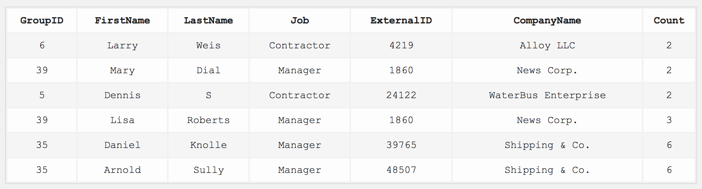

# challenge-coderbyte

## Matrix Challenge

### English

Have the function `MatrixChallenge(strArr)` read the array of strings stored in `strArr` which will represent a 2D N matrix, and your program should return the elements after printing them in a clockwise, spiral order. You should return the newly formed list of elements as a string with the numbers separated by commas.

For example: if strArr is `"[1, 2, 3]", "[4, 5, 6]", "[7, 8, 9]"` then this looks like the following 2D matrix:

1 2 3
4 5 6
7 8 9

So your program should return the elements of this matrix in a clockwise, spiral order which is: 1,2,3,6,9,8,7,4,5

Examples Input: `["[1, 2]", "[10, 14]"]`
Output: 1,2,14,10

Input: `["[4, 5, 6, 5]", "[1, 1, 2, 2]", "[5, 4, 2, 9]"]`
Output: 4,5,6,5,2,9,2,4,5,1,1,2

### Español

Haga que la función `MatrixChallenge(strArr)` lea la matriz de cadenas almacenadas en `strArr` que representará una matriz 2D N, y su programa debe devolver los elementos después de imprimirlos en el sentido de las agujas del reloj, en orden espiral. Debe devolver la lista de elementos recién formada como una cadena con los números separados por comas.

Por ejemplo: si strArr es `"[1, 2, 3]", "[4, 5, 6]", "[7, 8, 9]"` entonces esto se parece a la siguiente matriz 2D:

1 2 3
4 5 6
7 8 9

Así que tu programa debería devolver los elementos de esta matriz en el sentido de las agujas del reloj, en orden espiral que es: 1,2,3,6,9,8,7,4,5

Ejemplos Entrada: `["[1, 2]", "[10, 14]"]`
Salida: 1,2,14,10

# Back-end Challenge

### English

In the JavaScript file, write a program to perform a GET request on the route [https://coderbyte.com/api/challenges/json/age-counting](https://coderbyte.com/api/challenges/json/age-counting) which contains a data key and the value is a string which contains items in the format: `key=STRING`, `age=INTEGER`. Your goal is to count how many items exist that have an age equal to `32`. Then you should create a write stream to a file called `output.txt` and the contents should be the key values (from the json) each on a separate line in the order they appeared in the json file (the file should end with a newline character on its own line). Finally, then output the SHA1 hash of the file.

Example Input
`{"data":"key=IAfpK, age=32, key=WNVdi, age=64, key=jp9zt, age=40, key=9snd2, age=32"}`

File Contents (output.txt)
IAfpK
9snd2

Example Output
7caa78c7180ea52e5193d2b4c22e5e8a9e03b486

Example Output with ChallengeToken
684b30e9a8e5e22c4b2d3915e25ae0817c87aac7:583iuydkvsb

Once your function is working, take the final output string and combine it with your ChallengeToken, both in reverse order and separated by a colon.

Your ChallengeToken: `bsvkdyui385`

### Español

En el archivo JavaScript, escriba un programa para realizar una petición GET en la ruta [https://coderbyte.com/api/challenges/json/age-counting](https://coderbyte.com/api/challenges/json/age-counting) que contiene una clave de datos y el valor es una cadena que contiene elementos con el formato: `key=STRING`, `age=INTEGER`. Tu objetivo es contar cuántos ítems existen que tengan una edad igual a `32`. A continuación, debe crear un flujo de escritura a un archivo llamado `output.txt` y el contenido debe ser los valores clave (del json) cada uno en una línea separada en el orden en que aparecieron en el archivo json (el archivo debe terminar con un carácter de nueva línea en su propia línea). Por último, se mostrará el hash SHA1 del archivo.

Ejemplo Entrada
`{"data": "key=IAfpK, age=32, key=WNVdi, age=64, key=jp9zt, age=40, key=9snd2, age=32"}`

Contenido del fichero (output.txt)
IAfpK
9snd2

Ejemplo de salida
7caa78c7180ea52e5193d2b4c22e5e8a9e03b486

Ejemplo de salida con ChallengeToken
684b30e9a8e5e22c4b2d3915e25ae0817c87aac7:583iuydkvsb

Una vez que tu función esté funcionando, toma la cadena de salida final y combínala con tu ChallengeToken, ambas en orden inverso y separadas por dos puntos.

Su ChallengeToken: `bsvkdyui385`

# Back-end Challenge

### English

In the JavaScript file, write a program that simulates complex WebSocket message handling based on different message types and payload structures.

1. Define a function `advancedWebsocketHandler`, which takes an array of message strings. Each message string is a JSON object that represents a WebSocket message with varying structures based on the type:

```javascript
{
 type: 'create' | 'modify' | 'query',
 payload: {
  ... // varies based on the type
 },
}
```

2. Your function should process each message based on its type:

- For create messages, the payload will have itemName and quantity. Return a string "Created [quantity] of [itemName]".
- For modify messages, the payload will have itemId, action (add or subtract), and amount. Return a string "Item [itemId] quantity [action]ed by [amount]".
- For query messages, the payload will have queryType and queryValue. Return a string "Query of type [queryType] with value [queryValue] processed".

3. Return an array of strings representing the processed messages. Finally, console log the array.

Example Input:

```javascript
[
  '{"type":"create","payload":{"itemName":"Widget","quantity":5}}',
  '{"type":"modify","payload":{"itemId":3,"action":"add","amount":2}}',
  '{"type":"query","payload":{"queryType":"status","queryValue":"pending"}}',
];
```

Example Output:

```javascript
[
  "Created 5 of Widget",
  "Item 3 quantity added by 2",
  "Query of type status with value pending processed",
];
```

### Español

En el archivo JavaScript, escriba un programa que simule el manejo de mensajes WebSocket complejos basados en diferentes tipos de mensajes y estructuras de carga útil.

1. Define una función `advancedWebsocketHandler`, que toma un array de cadenas de mensajes. Cada cadena de mensaje es un objeto JSON que representa un mensaje WebSocket con diferentes estructuras basadas en el tipo:

```javascript
{
 type: 'create' | 'modify' | 'query',
 payload: {
  ... // varies based on the type
 },
}
```

2. Su función debe procesar cada mensaje en función de su tipo:

- Para los mensajes de creación, la carga útil tendrá `itemName` y `quantity`. Devuelve la cadena **"Created [quantity] de [itemName]"**.
- Para los mensajes de modificación, la carga útil tendrá itemId, acción (añadir o restar) y cantidad. Devuelve la cadena **"Item [itemId] quantity [action]ed by [amount]"**.
- Para los mensajes de consulta, la carga útil tendrá queryType y queryValue. Devuelve la cadena **"Query of type [queryType] with value [queryValue] processed"**.

3. Devuelve un array de cadenas que representan los mensajes procesados. Por último, registra el array en la consola.

Ejemplo de entrada:

```javascript
[
  '{"type":"create","payload":{"itemName":"Widget","quantity":5}}',
  '{"type":"modify","payload":{"itemId":3,"action":"add","amount":2}}',
  '{"type":"query","payload":{"queryType":"status","queryValue":"pending"}}',
];
```

Ejemplo de salida:

```javascript
[
  "Created 5 of Widget",
  "Item 3 quantity added by 2",
  "Query of type status with value pending processed",
];
```

# SQL Challenge

### English

Your table: maintable_21X83

MySQL version: 8.0.23

In this MySQL challenge, your query should return the vendor information along with the values from the table `cb_vendorinformation`. You should combine the values of the two tables based on the `GroupID` column. The final query should consolidate the rows to be grouped by `FirstName`, and a `Count` column should be added at the end that adds up the number of times that person shows up in the table. The output table should be sorted by the `Count` column in ascending order and then sorted by `CompanyName` in alphabetical order.

### Español

Your table: maintable_21X83

MySQL version: 8.0.23

En este desafío MySQL, su consulta debe devolver la información del proveedor junto con los valores de la tabla `cb_vendorinformation`. Debe combinar los valores de las dos tablas basándose en la columna `GroupID`. La consulta final debe consolidar las filas para agruparlas por `FirstName`, y al final debe añadirse una columna `Count` que sume el número de veces que esa persona aparece en la tabla. La tabla de salida debe estar ordenada por la columna `Count` en orden ascendente y luego ordenada por `CompanyName` en orden alfabético.


